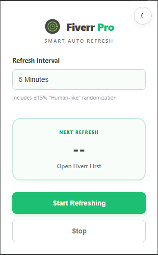
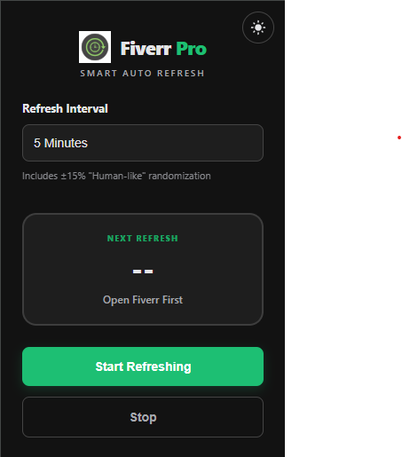

<p align="center">
  
  
</p>

# Fiverr Pro Auto Refresh


**Fiverr Pro Auto Refresh** is a premium Chrome extension designed for freelancers who want to stay competitive and never miss an opportunity. It goes beyond simple refreshing by mimicking real human browsing behavior, ensuring your "Online" status is maintained safely and effectively.

## 🚀 Key Features

- 🔄 **Custom Intervals**: Enter any refresh time in seconds (10-3600) for precise control.
- 🤖 **Smart Navigation**: Sequential rotation through Dashboard, Earnings, Briefs, and Referrals.
- 📩 **5-Cycle Inbox Priority**: Guaranteed inbox check every 5 refresh cycles.
- 🎲 **Human-Like Randomization**: Every refresh includes ±15-20% time variation to prevent detection.
- 🌓 **Elegant Dark Mode**: Professional UI with a persistent theme toggle for late-night sessions.
- 🌙 **Night-Time Optimization**: Intelligent slowdown during night hours (12 AM - 6 AM) for safer account management.
- ⚡ **Zero-Config Portability**: Fully self-contained and ready to work on any Windows/Mac machine.

## 🛠️ Installation

1.  Download the repository as a ZIP and extract it.
2.  Open **Google Chrome** and go to `chrome://extensions`.
3.  Enable **Developer mode** (top right toggle).
4.  Click **Load unpacked** and select the extension folder.

## 📖 Usage

1.  Open [Fiverr.com](https://www.fiverr.com) (ensure you are logged in).
2.  Click the **Fiverr Pro** icon in your browser toolbar.
3.  Select your preferred refresh interval.
4.  Click **Start Refreshing** and enjoy stay active 24/7!

## 📂 Project Structure

```text
/
├── assets/         # Professional icons and assets
├── src/            # Source code (Modular Architecture)
│   ├── background/ # Intelligent scheduler and navigation logic
│   ├── popup/      # Modern UI (HTML/CSS/JS)
│   └── shared/     # Configuration and utility functions
├── manifest.json   # Extension metadata and permissions
└── README.md       # Professional documentation
```

## 📄 License

This project is licensed under the MIT License - see the [LICENSE](LICENSE) file for details.
